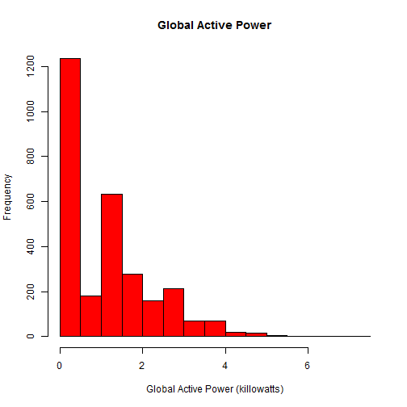
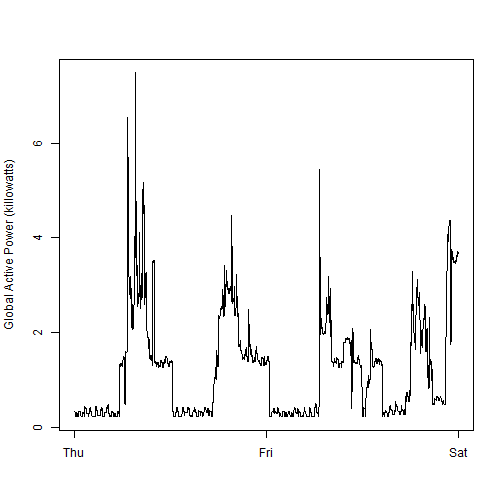
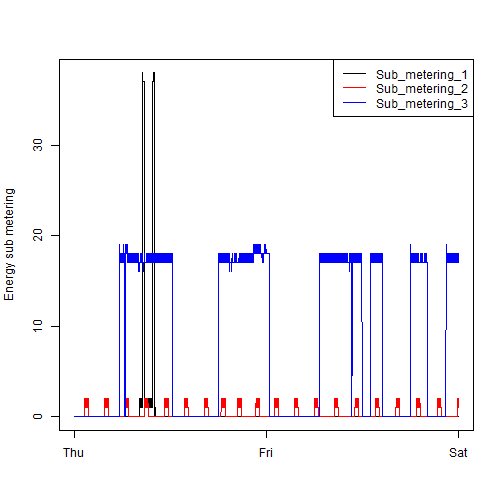
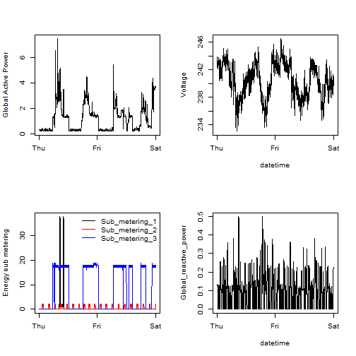

##Course Project 1 for Exploratory Analysis by John Hopkins University on coursera

This repository contains all the scripts required to process the original dataset provided and then plot all the required plots.

* process.R : This script downloads the original dataset and then filters out rows that were trivial for the assignment so that all the scripts used for plotting do not have to download the dataset again and also subset the dataset to get only required data.
* plot1.R : Creates plot1.png as required by the project.
* plot2.R : Creates plot2.png as required by the project.
* plot3.R : Creates plot3.png as required by the project.
* plot4.R : Creates plot4.png as required by the project.

All the plotting scripts(plot1.R, plot2.R, plot3.R, plot4.R) calls process.R only if they do not get data.csv file in the working directory. If the data.csv file is present then the plotting scripts assumes them to be the data used for plotting otherwise process.R creates this file by processing the original dataset.

Please check below the required plots and the plots that the written scripts created. These plot files can also be found inside the  plots folder in this repository.

### Plot 1

####Required

####What my script created
 

### Plot 2

####Required
 
####What my script created
 

### Plot 3

####Required
 
####What my script created
 

### Plot 4

####Required
 
####What my script created
 

NOTE:This assignment uses data from
the <a href="http://archive.ics.uci.edu/ml/">UC Irvine Machine
Learning Repository</a>, a popular repository for machine learning
datasets. In particular, we will be using the "Individual household
electric power consumption Data Set".

* <b>Dataset</b>: <a href="https://d396qusza40orc.cloudfront.net/exdata%2Fdata%2Fhousehold_power_consumption.zip">Electric power consumption</a> [20Mb]

* <b>Description</b>: Measurements of electric power consumption in
one household with a one-minute sampling rate over a period of almost
4 years. Different electrical quantities and some sub-metering values
are available.
